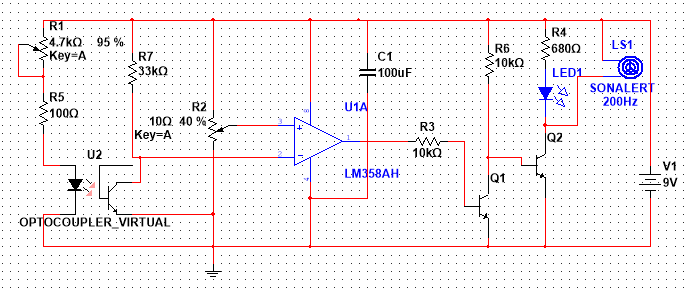

# Optical_Smoke_Alarm
A project on optical smoke alarm 

**An Optical Smoke Detector is a device that senses smoke, typically as an indicator of fire.**

## Components Used
* 10K potentiometer.
* IC MOC7811.
* IC LM358.
* Resistors: 100 ohms, 680 ohms, 33K, 10K and 220 ohms.
* Two transistors BC547A.
* 1 LED.
* 1 electric buzzer.
* 1 Capacitor 100 microfarad, 25 volts.

## Description

## Schematic of the whole circuit

## Schematic of circuit in NI Multisim

## Schematic of PCB Design

